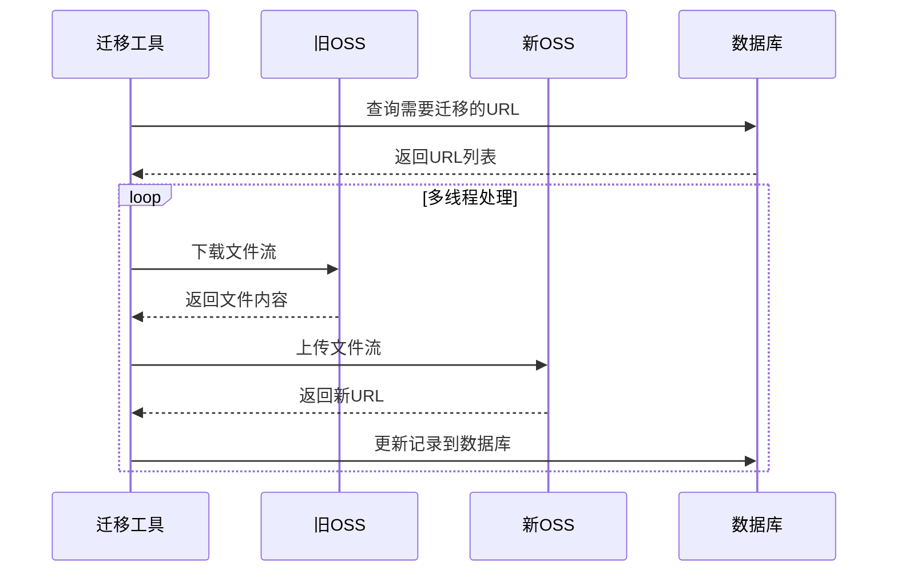

# Remove_Oldoss_to_New
# 阿里云OSS批量迁移工具（支持数据库同步）

[](https://www.oracle.com/java/)
[](https://www.apache.org/licenses/LICENSE-2.0)
[](https://www.aliyun.com/product/oss)

专业的企业级OSS数据迁移解决方案，支持文件迁移与数据库记录同步更新。适用于系统迁移、跨地域复制、存储类型升级等场景。

## 📌 功能特性

### 核心功能
- **双端OSS操作**
  - 自动下载旧Bucket文件
  - 并行上传至新Bucket
  - 保留原始文件目录结构
- **数据库智能同步**
  - MySQL URL记录自动更新
  - 支持WHERE条件过滤
  - 批量更新优化
- **高效传输**
  - 多线程并发处理（可配置线程数）
  - 流式传输减少内存占用
  - 自动重试机制（网络波动容错）

### 增强特性
- ⚡ 断点续传支持
- 🔒 敏感配置项安全提示
- 📊 迁移进度统计
- 📝 操作日志记录
- ❌ 异常文件清单生成

## 🚀 快速入门

### 环境要求
- JDK 8+
- Maven 3.6+
- MySQL 5.7+
- 阿里云OSS访问密钥

### 部署步骤

1. **克隆仓库**

```bash
git clone https://github.com/yourusername/oss-migration-tool.git
cd oss-migration-tool
```

2. **编译构建**

```bash
mvn clean package -DskipTests
```

3. **配置参数**

```properties
# 旧OSS配置（只读）
old.oss.endpoint = https://oss-cn-beijing.aliyuncs.com
old.oss.bucket = legacy-bucket
old.oss.prefix = https://legacy-bucket.oss-cn-beijing.aliyuncs.com/

# 新OSS配置（读写）
new.oss.endpoint = https://oss-cn-shanghai.aliyuncs.com
new.oss.bucket = new-bucket
new.oss.accessKeyId = your-access-key
new.oss.accessKeySecret = your-secret-key

# 数据库配置
db.url = jdbc:mysql://localhost:3306/mydb
db.user = admin
db.password = securepassword
```

4. **执行迁移**

```bash
java -jar target/oss-migration-1.0.0.jar
```

## 🛠 配置详解

### 文件路径配置

| 配置项        | 示例值 | 说明 |
|--------------|----------------|-------------|
| old.oss.prefix | `https://old-bucket.oss-cn-hangzhou.aliyuncs.com/` | 旧OSS地址前缀，必须/结尾 |
| new.oss.prefix | `https://new-bucket.oss-cn-shanghai.aliyuncs.com/` | 新OSS地址前缀 |

### 线程池配置

```java
private static final int THREAD_POOL_SIZE = 10; // 根据网络带宽调整
private static final int RETRY_COUNT = 3;      // 失败重试次数
private static final int TIMEOUT_MINUTES = 60; // 任务超时时间
```

### 数据库表结构

需确保目标表包含URL字段：

```sql
CREATE TABLE `file_records` (
  `id` INT PRIMARY KEY AUTO_INCREMENT,
  `file_url` VARCHAR(500) NOT NULL COMMENT '文件URL'
  -- 其他字段...
) ENGINE=InnoDB DEFAULT CHARSET=utf8mb4;
```

## 📊 系统架构



## ⚠️ 注意事项

### 权限验证
- 确保新OSS账号有 `PutObject` 权限
- 数据库账号需要 `UPDATE` 权限

### 网络要求
- 旧OSS需要开放公网访问
- 建议在阿里云内网环境运行

### 数据安全
- 迁移前务必进行数据备份
- 建议先进行小批量测试迁移

### 费用说明
- 跨区域传输可能产生流量费用
- 大量请求可能产生API调用费用

## 📈 性能指标

测试环境配置：
- **阿里云ECS** 4核8G
- **带宽** 100Mbps

| 文件大小 | 文件数量 | 耗时 |
|---------|---------|------|
| 1MB     | 10,000  | 2m35s |
| 10MB    | 1,000   | 1m50s |
| 100MB   | 100     | 3m10s |

## 🤝 参与贡献

欢迎通过 Issue 和 PR 参与改进：

### 报告问题模板

```markdown
## 问题描述

## 重现步骤
1. 
2. 
3. 

## 预期行为

## 实际行为

## 环境信息
- OS: [e.g. CentOS 7.6]
- Java版本: [e.g. openjdk 1.8.0_312]
```

### 代码贡献指南
- 遵循 Google Java 代码规范
- 新增功能需附带单元测试
- 提交前执行 `mvn verify`
